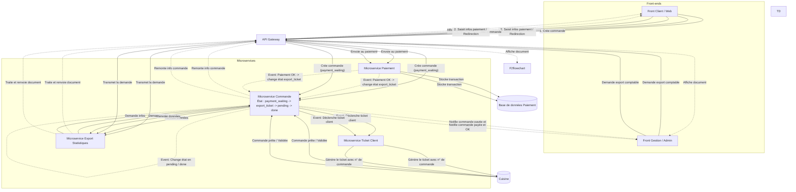

```mermaid
flowchart TD
    subgraph Clients [Front-ends]
        F1[Front Client / Web]
        F2[Front Gestion / Admin]
    end

    GW[API Gateway]

    subgraph Microservices [Microservices]
        MC[Microservice Commande<br/>État : payment_waiting -> export_ticket -> pending -> done]
        MP[Microservice Paiement]
        MT[Microservice Ticket Client]
        MEC[Microservice Export Statistiques]
    end

    DBP[(Base de données Paiement)]
    CUIS[(Cuisine)]

    %% 1. Création initiale de la commande par le client
    F1 -->|1. Crée commande| GW
    GW -->|"Crée commande (payment_waiting)"| MC
    MC -.->|Remonte info commande| GW
    GW -.->|Affiche page de paiement| F1

    %% 2. Saisie des infos de paiement et déclenchement d'événements
    F1 -->|2. Saisit infos paiement / Redirection| GW
    GW -->|Envoie au paiement| MP
    MP -->|Stocke transaction| DBP
    
    %% 3. Événements, Ticket, Cuisine et notification Admin
    MP -.->|"Event: Paiement OK -> change état export_ticket"| MC
    MC -->|Event: Déclenche ticket client| MT
    MT -->|Génère le ticket avec n° de commande| CUIS
    CUIS -->|Commande prête / Validée| MC
    MC -.->|"Event: Change état en pending / done"| MC
    MC -.->|Notifie commande payée et OK| F2

    %% 4. Export Comptable depuis l'Admin
    F2 -->|Demande export comptable| GW
    GW -->|Transmet la demande| MEC
    MEC -->|Demande infos| MC
    MC -->|Renvoie données| MEC
    MEC -.->|Traite et renvoie document| GW
    GW -.->|Affiche document| F2flowchart 
    TD
    subgraph Clients [Front-ends]
        F1[Front Client / Web]
        F2[Front Gestion / Admin]
    end

    GW[API Gateway]

    subgraph Microservices [Microservices]
        MC[Microservice Commande<br/>État : payment_waiting -> export_ticket -> pending -> done]
        MP[Microservice Paiement]
        MT[Microservice Ticket Client]
        MEC[Microservice Export Statistiques]
    end

    DBP[(Base de données Paiement)]
    CUIS[(Cuisine)]

    %% 1. Création initiale de la commande par le client
    F1 -->|1. Crée commande| GW
    GW -->|"Crée commande (payment_waiting)"| MC
    MC -.->|Remonte info commande| GW
    GW -.->|Affiche page de paiement| F1

    %% 2. Saisie des infos de paiement et déclenchement d'événements
    F1 -->|2. Saisit infos paiement / Redirection| GW
    GW -->|Envoie au paiement| MP
    MP -->|Stocke transaction| DBP
    
    %% 3. Événements, Ticket, Cuisine et notification Admin
    MP -.->|"Event: Paiement OK -> change état export_ticket"| MC
    MC -->|Event: Déclenche ticket client| MT
    MT -->|Génère le ticket avec n° de commande| CUIS
    CUIS -->|Commande prête / Validée| MC
    MC -.->|"Event: Change état en pending / done"| MC
    MC -.->|Notifie commande payée et OK| F2

    %% 4. Export Comptable depuis l'Admin
    F2 -->|Demande export comptable| GW
    GW -->|Transmet la demande| MEC
    MEC -->|Demande infos| MC
    MC -->|Renvoie données| MEC
    MEC -.->|Traite et renvoie document| GW
    GW -.->|Affiche document| F2
```